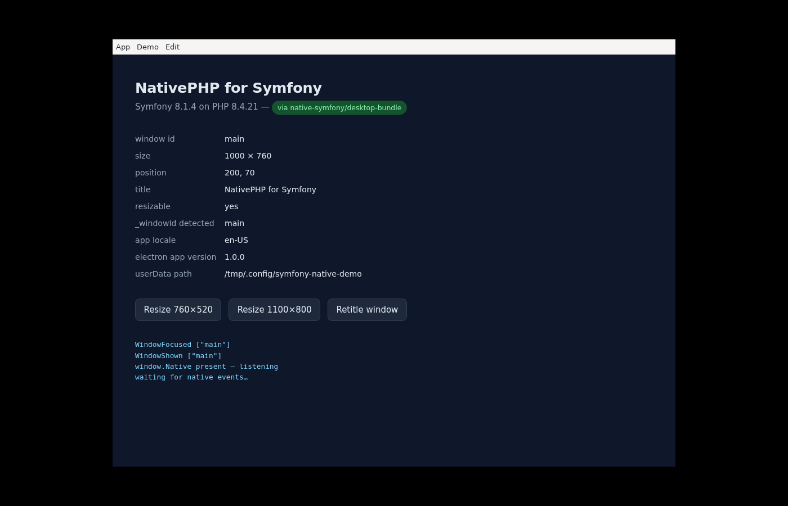

# NativePHP for Symfony

Bringing [NativePHP](https://nativephp.com)'s desktop runtime to Symfony: build desktop
applications with Symfony and PHP, on the same Electron runtime the Laravel version uses.

Working, and proven end-to-end — a Symfony 8 app in a native window, driving the runtime's
full API, packaged into a distributable app that has been built *and run*.

## Where things are

| | |
|---|---|
| **[`bundle/`](bundle/README.md)** | `native-symfony/desktop-bundle` — desktop. All 116 runtime endpoints, all 44 events, 235 tests. Verified by a running packaged app. |
| **[`mobile-bundle/`](mobile-bundle/README.md)** | `native-symfony/mobile-bundle` — iOS and Android. All 54 bridge methods, the SAPI shim, the persistent runtime, and native-UI element trees byte-identical to upstream's. 76 tests. Verified by tests, **not** by a device. |
| [`spike/`](spike/README.md) | The reproduction harness: a container with PHP 8.4 + Node 22 + Electron, the runtime patch, and headless runners that screenshot the result. |
| `upstream/` | Shallow reference clones of `NativePHP/desktop` and `NativePHP/mobile-air` (gitignored; clone on demand). |

## The documents, in reading order

1. **[PLAN.md](PLAN.md)** — what NativePHP actually is, where Laravel leaks, and the
   roadmap. Start here.
2. **[ANALYSIS.md](ANALYSIS.md)** — the deep dive: the exact boot sequence, a per-directory
   port map with LOC, the eight Laravel-isms in the runtime's TypeScript with line numbers,
   the Symfony-specific design decisions, and the upstream bugs found along the way.
3. **[CONTRACT.md](CONTRACT.md)** — the wire protocol. All 116 endpoints with request and
   response shapes, all 44 events with payload shapes, the environment contract, and the
   seven things the runtime requires of any PHP app.
4. **[SPIKE-RESULTS.md](SPIKE-RESULTS.md)** — M1: proving it possible at all.
5. **[M2-RESULTS.md](M2-RESULTS.md)** — the bundle.
6. **[M3-RESULTS.md](M3-RESULTS.md)** — the build pipeline.
7. **[MOBILE-ANALYSIS.md](MOBILE-ANALYSIS.md)** — mobile, and a correction to an earlier
   conclusion that was wrong.
8. **[NATIVE-UI-CONTRACT.md](NATIVE-UI-CONTRACT.md)** — the native-UI wire format: the
   protocol the SwiftUI and Compose renderers consume, and what a Twig front end
   (the `super-native` equivalent) would have to produce.

## The short version

The Laravel coupling in NativePHP's desktop runtime turned out to be **eight hardcoded
string literals in one TypeScript file**, not an architecture. The PHP↔runtime boundary is
already framework-neutral: localhost HTTP and JSON, with a shared-secret header.

So the adapter needs no fork. `native:install --publish` upstream already mirrors the whole
Electron project into the application's own directory, and the runtime prefers that copy —
so each app patches its own, idempotently, and the proper fix upstream is a small
behaviour-preserving manifest PR.

Mobile splits in two, and an earlier version of this README got it wrong by pricing the
whole thing at the cost of the harder half. Its native-UI engine really is 17,316 LOC coupled
to Blade — but it is **optional**: both platforms' `BootPlanner` falls back to a WebView
whenever an app registers no native routes, and `NATIVEPHP_BOOT_MODE=web` forces it. So a
Symfony mobile app needs a ~100-line SAPI shim and wrappers for 54 bridge methods, not a
rendering-engine port. See [MOBILE-ANALYSIS.md](MOBILE-ANALYSIS.md).

## Status

| | |
|---|---|
| **Desktop** | Done and proven end-to-end, including a packaged app that has been built and run. |
| **Mobile — WebView path** | Implemented and tested. No device verification yet; this environment has no Xcode or Android SDK. |
| **Mobile — native UI** | Under way. The wire format is implemented and **byte-verified** against upstream's collector, authored from Twig. Remaining: the style parser, native routing, and a component lifecycle. |

M0 (contract), M1 (spike), M2 (bundle), M3 (build pipeline) and M5 (mobile WebView)
are done.

Left: proposing the manifest change upstream, along with nine independent bug fixes found
while building this — each worth submitting on its own merits. Prior art is
[NativePHP discussion #504](https://github.com/NativePHP/laravel/discussions/504).

## Licence

MIT, matching `nativephp/desktop`. The `native-symfony` vendor name is provisional —
`nativephp/*` is someone else's brand, and asking comes before claiming it.
