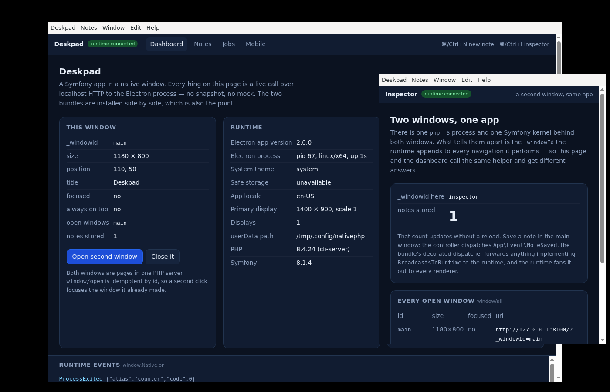
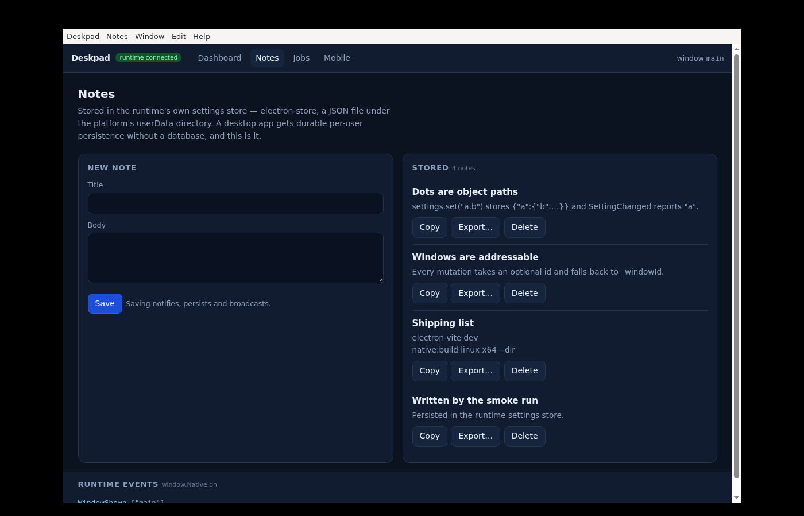
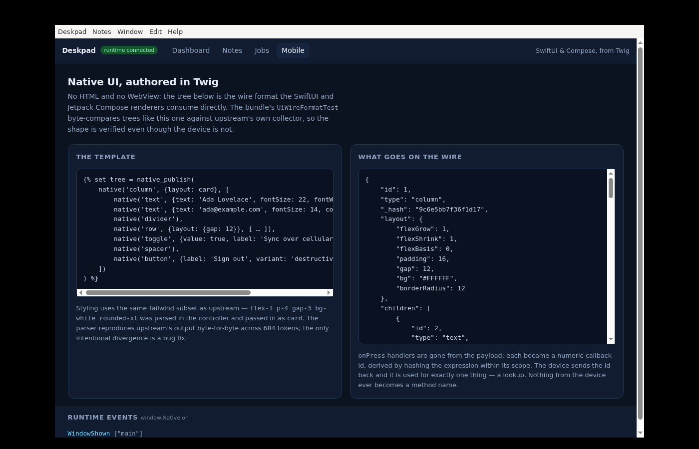

# Deskpad — the demo application

A small notes app, built with Symfony 8, running in a native window on NativePHP's
Electron runtime. It installs **both** bundles — `native-symfony/desktop-bundle` and
`native-symfony/mobile-bundle` — and it doubles as their integration test: everything
below was captured by booting the real runtime headlessly and driving it.



Two windows, one PHP process. The application menu at the top is built in PHP. The
event feed along the bottom is `window.Native.on`. The `notes stored` count in the
second window went from 0 to 1 without a reload, because a PHP event was broadcast to
every renderer.

## What to look at

Read these five files and you have seen the whole desktop surface.

| File | Why |
|---|---|
| [`src/Bootstrapper.php`](src/Bootstrapper.php) | The entire app-startup contract: the runtime POSTs `/_native/api/booted`, this decides what appears. Opens the main window, builds the application and context menus, registers a global shortcut. |
| [`src/EventListener/MenuActionListener.php`](src/EventListener/MenuActionListener.php) | What menu items *do*. An item carries a name, not a callback — clicking one comes back as an event over HTTP, and this is the other end of it. |
| [`src/EventListener/RuntimeEventLogger.php`](src/EventListener/RuntimeEventLogger.php) | The reverse channel, typed: `$event->width`, not `$payload[1]`. Ten of the runtime's 44 events, with the two behaviours that surprise people written down where they bite. |
| [`src/Controller/NoteController.php`](src/Controller/NoteController.php) | The app's one real feature. Saving a note touches the settings store, a notification and a broadcast; exporting one opens a native save dialog. |
| [`src/Event/NoteSaved.php`](src/Event/NoteSaved.php) | An ordinary Symfony event that also reaches every window's JavaScript, because it implements `BroadcastsToRuntime`. |

And for mobile, three:

| File | Why |
|---|---|
| [`src/Mobile/CounterScreen.php`](src/Mobile/CounterScreen.php) | A `#[NativeScreen]` component: state as a typed property, one `#[NativeAction]` the device may call, one public method it may not. |
| [`templates/mobile/profile.html.twig`](templates/mobile/profile.html.twig) | A native screen authored with the `native()` and `native_publish()` Twig functions — no HTML, no WebView. The page prints the wire tree it produced. |
| [`src/Mobile/ScreenCatalog.php`](src/Mobile/ScreenCatalog.php) | Why native screens are listed explicitly instead of scanned for: the build-time list and the runtime list have to be the same list. |

### The screens

**Dashboard** (`/`) — every value is a live round trip to the Electron process over
localhost HTTP. Window geometry, the detected `_windowId`, the Electron process, the
system theme, the display, the userData path. Opens and closes the second window.

**Notes** (`/notes`) — create, copy and delete notes persisted in the runtime's own
settings store (electron-store, a JSON file under userData). Saving notifies and
broadcasts; **Export…** opens a native save sheet.



**Jobs** (`/jobs`) — child processes. A PHP one-liner and the app's own
`app:report` console command, both spawned by the runtime with its PHP binary and its
whole `NATIVEPHP_*` environment. Their stdout arrives as events, in PHP *and* in the
page.

**Mobile** (`/mobile`) — the other bundle: the WebView path, the native-UI path, and a
stateful component. Read the honesty section below before believing any of it.



## Running it

There is no PHP and no modern Node on this host, so everything runs in the
`np-symfony-spike` container (PHP 8.4, Node 22, Electron's system libraries, Xvfb,
ImageMagick). Build it once from [`../spike/Dockerfile`](../spike/README.md) if it does
not exist:

```bash
docker build -t np-symfony-spike ../spike
```

`D` is the invocation used throughout — note that the two bundles are installed
through composer *path* repositories, so `/bundle` and `/mobile-bundle` must be
mounted at runtime as well as at install time, or `vendor/` points at nothing:

```bash
D() { docker run --rm -u $(id -u):$(id -g) \
  -e HOME=/tmp -e COMPOSER_HOME=/tmp/composer -e npm_config_cache=/tmp/npmcache \
  -v "$PWD/..":/np -v "$PWD/../bundle":/bundle -v "$PWD/../mobile-bundle":/mobile-bundle \
  -w /np/demo np-symfony-spike bash -lc "$1"; }
```

### 1. Dependencies

```bash
D 'composer install'
```

### 2. The Electron runtime

The runtime lives in the application, not in `vendor/` — each app patches its own copy,
because upstream hardcodes eight Laravel-specific strings in its TypeScript and
`native:install --publish` upstream already mirrors the project into the app directory.
This step copies it, patches it, runs `npm install` (~115MB, several minutes) and
rebuilds the plugin from the patched sources:

```bash
D 'php bin/console native:install --source=/np/upstream/np-desktop/resources/electron'
```

If `../upstream/np-desktop` is not there:
`git clone --depth 1 https://github.com/NativePHP/desktop ../upstream/np-desktop`.

### 3. Start it

On a machine with a display, that is all `native:run` needs:

```bash
D 'php bin/console native:run'
```

Headless — which is how every screenshot in this README was made:

```bash
docker run --rm -u $(id -u):$(id -g) -e HOME=/tmp -e npm_config_cache=/tmp/npmcache \
  -e SHOT2=/np/demo/shot-notes.png \
  -e SHOT3=/np/demo/shot-dialog.png \
  -e SHOT4=/np/demo/shot-mobile.png \
  -v "$PWD/..":/np -v "$PWD/../bundle":/bundle -v "$PWD/../mobile-bundle":/mobile-bundle \
  -w /np/demo np-symfony-spike bash /np/demo/run.sh /np/demo/shot-dashboard.png 45
```

[`run.sh`](run.sh) starts an X server, runs `bin/console native:run` — the same command
a developer types, rather than a reimplementation of it — waits for the PHP server, and
then drives the app. Two things in it are worth understanding:

- **It lifts the shared secret out of the running PHP server's own `/proc/*/environ`.**
  The secret is generated inside the runtime and handed to PHP as an environment
  variable; it is never logged, and every request without it is rejected with a 403. A
  harness outside both processes has no other way to make a request the app will accept.
- **It clicks menu items by POSTing to `/_native/api/events`** with the item's event
  name, which is byte for byte what the runtime sends when a real item is clicked. That
  is how a menu, a global shortcut and a context menu are verified without a mouse.

### Without a runtime

Every page renders in a plain browser too, with a `plain browser` badge instead of
`runtime connected` — a native app you cannot open in a browser is a native app you
cannot develop:

```bash
D 'php -S 0.0.0.0:8080 -t public public/index.php'
```

## What was actually verified

Everything in this list was observed in a run of this app on this machine. The output
of that run is what the screenshots are.

| Claim | Evidence |
|---|---|
| The app boots and paints | `shot-dashboard.png` |
| Two windows, distinct `_windowId` per window | Same shot: `main` in one, `inspector` in the other, both from `WindowManager::detectId()` |
| The application menu is real | The menu bar in every shot, built by `Bootstrapper::boot()` |
| Menu items work | `App\Menu\OpenInspector` opened the second window; `App\Menu\Seed` wrote three notes and navigated the main window; `App\Menu\MobileScreens` navigated it again — all driven as events, all visible in the shots |
| Settings persistence | `_smoke` wrote, read back `probe`, forgot it, and read `gone`; the four notes in `shot-notes.png` came out of the store |
| Clipboard | `_smoke` wrote a random marker and read the same string back through the runtime |
| A native dialog | `shot-dialog.png` — a GTK save sheet with the app's own default filename and button label |
| A child process | `counter` spawned as a real pid, streamed `tick 1…5` and `done`, exited 0 — in `var/log/dev.log` and in the page's event feed |
| Typed events reaching PHP | `ApplicationBooted`, `WindowShown`, `WindowFocused`, `WindowClosed`, `SettingChanged`, `ProcessSpawned`, `MessageReceived`, `ProcessExited` all logged by `RuntimeEventLogger` |
| Events reaching the renderer | The feed at the bottom of every screenshot is `window.Native.on` output |
| A PHP event reaching the renderer | The `notes stored` count in the second window shows `1` after the smoke run saved a note — the page was rendered when it was still 0 |
| The browser gate | `GET /` with no secret → **403**; with the secret → **200** |
| Both bundles in one app | The container builds and every page renders with both registered |

The full `_smoke` output from that run:

```json
{
  "runtime":  {"pid": 67, "platform": "linux", "arch": "x64", "uptime": 12.3},
  "windows":  {"ids": ["main", "inspector"], "main_size": "1180x827", "main_title": "Deskpad"},
  "clipboard":{"wrote": "deskpad-30695cea", "read": "deskpad-30695cea"},
  "settings": {"read": "probe", "after_forget": "gone"},
  "notes":    {"saved": "Written by the smoke run", "total": 1},
  "notification": {"reference": "1786730980084.wm5xyc5"},
  "child_process": {"alias": "smoke", "pid_on_start": null},
  "system":   {"theme": "system", "can_encrypt": false},
  "power":    {"idle_state": "active", "on_battery": false},
  "shortcut": {"registered": true}
}
```

`shortcut.registered: true` is the one to notice: the shortcut is registered in
`Bootstrapper::boot()`, so a `false` there would mean the boot hook never ran.

## What was not verified, and cannot be here

**Nothing mobile has run on a device.** `nativephp_call()` is a compiled extension that
exists only inside a packaged iOS or Android app, and this environment has no Xcode and
no Android SDK. The mobile screens run against the recording fake the bundle ships
(`native_mobile.fake_bridge: true`) and show what *would* be sent. The element trees are
byte-compared against upstream's own collector in the bundle's test suite, so the wire
format is verified — the device is not. Treat the desktop and mobile halves as holding
different grades of evidence, because they do.

**The `/mobile/counter` page replays taps.** On a device the screen object is held by the
runloop and `$count` survives between interactions because the PHP process is long-lived.
A browser request is a fresh process, so that page calls `frame()` and then `handle()`
once per tap to reach frame N. It demonstrates the frame cycle honestly; it does not
simulate the device's lifetime, and the page says so.

**Notifications appear in the log, not on screen.** The container has no D-Bus, so
`notify_notification_show` fails with `Unknown or unsupported transport "disabled"`. The
call and the reference it returns are real (`_smoke` shows one); the toast has nowhere to
go. On a desktop it appears.

**`can_encrypt` is `false` and there is no keyring.** Same cause. Not a bug.

**Nothing is packaged.** `native:build` is the desktop bundle's, and it is proven in
`../M3-RESULTS.md` by a packaged app that was built and run. This demo only exercises
development mode.

**The dialog screenshot wedges the run.** A native dialog holds the runtime's main
thread until someone answers it, so `run.sh` takes that shot last and on purpose. Nothing
automated touches `Export…` except that final step.

## How this differs from `spike/app`

`../spike/app` was grown while proving each piece worked, and it shows: one controller
of buttons, one diagnostics route, one page. It is a harness. This is an application —
four screens with a reason to exist, a menu whose items do things, an event that travels
PHP → runtime → every window, and a second window that is not just "a second window".

Concretely: `_windowId` is *used* here (two windows that report different ones) rather
than printed; the diagnostics route became `/_smoke` and asserts values rather than
listing them; menu items are an enum shared between the builder and the handler instead
of loose strings; and the runner drives menu events and captures four screenshots
instead of one.

`spike/app` is left where it is — it is what `../SPIKE-RESULTS.md` refers to.

## What the bundles could do better

Found while building this. **Neither is a bug**, and neither was changed from here.

1. **A `#[NativeScreen]` component cannot be rendered by the bundle's own responder
   without app glue.** `NativeScreenResponder` resolves a path to a screen class and
   then asks a `ScreenRendererInterface` for an element — and nothing in the bundle
   implements that interface, while `ComponentScreenFactory` sits next door doing
   almost exactly the job. The seam is deliberate and the reasoning in the docblock is
   sound, but the result is that the two halves of the native-UI path do not join up
   out of the box. A `ComponentScreenRenderer` in the bundle would close it.

2. **`native:install` writes `public/nativephp-router.php` but the routes import is
   manual.** The command already edits the application (the router script), so the one
   remaining hand-edit — `config/routes/native_desktop.yaml` — could be written the same
   way, or at least printed as a next step. Forgetting it produces an app that boots and
   then shows nothing at all, because `/booted` 404s and `boot()` never runs; that is a
   confusing first five minutes for something the installer knows how to fix.

## Layout

```
src/Bootstrapper.php              the app-startup contract
src/Controller/                   four screens, plus /_smoke
src/Event/                        MenuAction (the names), NoteSaved (the broadcast)
src/EventListener/                menu actions, and the typed runtime events
src/Note/                         the feature: notes in the runtime settings store
src/Command/ReportCommand.php     something for a child process to run
src/Mobile/                       a native screen component and the screen catalog
templates/                        base + four screens + three mobile screens
config/packages/native_*.yaml     both bundles configured
config/routes/native_desktop.yaml the required routes import
run.sh                            headless boot, drive, screenshot
nativephp/                        the patched runtime (gitignored, ~900MB)
shot-*.png                        captured from a real run
```
